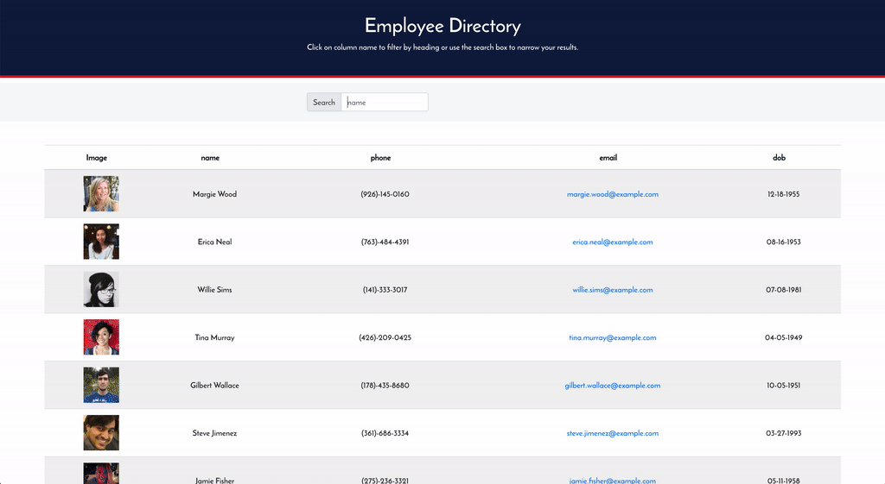

[contributors-shield]: https://img.shields.io/github/contributors/kkuznets/employee-directory.svg?style=for-the-badge&color=blueviolet
[contributors-url]: https://github.com/kkuznets/employee-directory/graphs/contributors
[forks-shield]: https://img.shields.io/github/forks/kkuznets/employee-directory.svg?style=for-the-badge&color=brightgreen
[forks-url]: https://github.com/kkuznets/employee-directory/network/members
[stars-shield]: https://img.shields.io/github/stars/kkuznets/employee-directory.svg?style=for-the-badge&color=orange
[stars-url]: https://github.com/kkuznets/employee-directory/stargazers
[issues-shield]: https://img.shields.io/github/issues/kkuznets/employee-directory.svg?style=for-the-badge&color=blue
[issues-url]: https://github.com/kkuznets/employee-directory/issues
[license-shield]: https://img.shields.io/github/license/kkuznets/employee-directory.svg?style=for-the-badge&color=ff69b4
[license-url]: https://github.com/kkuznets/employee-directory/blob/master/LICENSE
[linkedin-shield]: https://img.shields.io/badge/-LinkedIn-black.svg?style=for-the-badge&logo=linkedin&colorB=555
[linkedin-url]: https://linkedin.com/in/kkuznets

[![Contributors][contributors-shield]][contributors-url] [![Forks][forks-shield]][forks-url] [![Stargazers][stars-shield]][stars-url] [![Issues][issues-shield]][issues-url] [![MIT License][license-shield]][license-url] [![LinkedIn][linkedin-shield]][linkedin-url]

# Employee Directory System <!-- omit in toc -->

> Agile simple web application that allows users to manage non-sensitive information about their employees in a fast and efficient manner.



## 🚩 Table of Contents <!-- omit in toc -->

- [📦 Built With](#-built-with)
- [🚀 Features](#-features)
- [🔧 Getting Started](#-getting-started)
- [✍️ Pull Request](#️-pull-request)
- [💬 Contributing](#-contributing)
- [📜 License](#-license)

## 📦 Built With

-  [React](https://reactjs.org/)
-  [React Hooks](https://reactjs.org/docs/hooks-intro.html)
-  [randomuser.me API](https://randomuser.me/)

## 🚀 Features

-  Manage and search up your employees easily!
-  Sort your employees by their name, date of birth, phone number, or email.
-  Can run offline now!

## 🔧 Getting Started

Simply run

```zsh
$ npm build
```

And start developing! All your edits wil be automatically reflected on your local host.

## ✍️ Pull Request

Before creating a PR, test and check for any errors. If there are no errors, then commit and push.

For more information, please refer to the Contributing section.

## 💬 Contributing

Contributions are what make the open source community such an amazing place to be learn, inspire, and create. Any contributions you make are greatly appreciated.

1. Fork the Project
2. Create your Feature Branch (git checkout -b feature/AmazingFeature)
3. Commit your Changes (git commit -m 'Add some AmazingFeature')
4. Push to the Branch (git push origin feature/AmazingFeature)
5. Open a [Pull Request](#️-pull-request)

## 📜 License

This software is licensed under the [MIT](https://github.com/kkuznets/employee-directory/blob/master/LICENSE) © [kkuznets](https://github.com/kkuznets).
